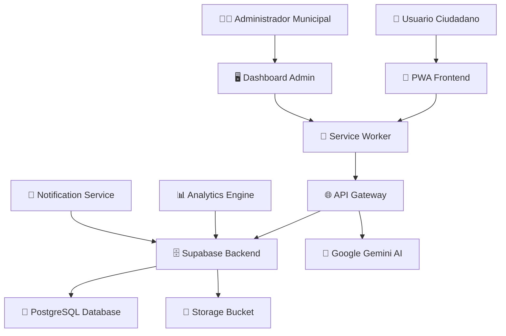

# Vigilantes del Aedes

<div align="center">


**Sistema de Vigilancia Epidemiológica Colaborativa para el Control del Aedes aegypti**

*Desarrollado para la Municipalidad de Posadas, Misiones, Argentina*

[🌐 Demo en Vivo](https://vigilantes-aedes.netlify.app) | [📖 Documentación](https://github.com/iNeenah/Aedes/wiki) | [🐛 Reportar Issue](https://github.com/iNeenah/Aedes/issues)

</div>

---

## 📋 Descripción del Proyecto

**Vigilantes del Aedes** es una plataforma web progresiva (PWA) que revoluciona la prevención del dengue mediante la participación ciudadana activa. La aplicación permite a los residentes de Posadas reportar criaderos de mosquitos Aedes aegypti en tiempo real, creando una red colaborativa de vigilancia epidemiológica.

### 🎯 Objetivos Principales

- **Prevención Proactiva**: Detección temprana de focos de reproducción del Aedes aegypti
- **Participación Ciudadana**: Involucrar a la comunidad en la lucha contra el dengue
- **Gestión Municipal**: Proporcionar herramientas de análisis y respuesta rápida
- **Análisis Epidemiológico**: Generar datos para políticas públicas basadas en evidencia

## ⚡ Características Principales

### 🗺️ **Sistema de Mapeo Inteligente**
- Mapa de calor dinámico con visualización de criticidad temporal
- Geolocalización automática con precisión GPS
- Capas intercambiables para diferentes tipos de análisis
- Integración con OpenStreetMap y tiles personalizados

### 🤖 **Inteligencia Artificial Integrada**
- **Google Gemini 2.0**: Optimización automática de ubicaciones
- Análisis predictivo de patrones de propagación
- Sugerencias inteligentes para intervenciones

### 📊 **Sistema de Criticidad Evolutiva**
- Evaluación inicial por parte del ciudadano (Baja, Media, Alta, Crítica)
- Evolución automática basada en tiempo transcurrido
- Algoritmo de peso dinámico para priorización de recursos

### 📱 **Progressive Web App (PWA)**
- Funcionalidad offline completa
- Instalable en dispositivos móviles y desktop
- Sincronización automática cuando hay conectividad
- Service Workers para cache inteligente

### 🔄 **Tiempo Real y Colaboración**
- Sincronización instantánea con base de datos
- Notificaciones push para alertas críticas
- Sistema de gamificación para incentivar participación
- Dashboard administrativo para gestión municipal

## 🏗️ Arquitectura del Sistema

### 📐 **Arquitectura General**



### 🛠️ **Stack Tecnológico Completo**

#### **Frontend**
- **React 18.2.0**: Framework principal con Hooks y Context API
- **Tailwind CSS 3.3.0**: Framework de estilos utilitarios
- **React-Leaflet 4.2.1**: Componentes de mapas interactivos
- **Leaflet.heat**: Plugin para mapas de calor
- **Workbox**: Service Workers para PWA

#### **Backend & Servicios**
- **Supabase**: Backend-as-a-Service con PostgreSQL
- **PostgreSQL 15**: Base de datos relacional con extensiones GIS
- **Supabase Storage**: Almacenamiento de imágenes y archivos
- **Supabase Realtime**: WebSockets para actualizaciones en tiempo real
- **Google Gemini 2.0**: API de inteligencia artificial

#### **DevOps & Deployment**
- **Vite**: Build tool y desarrollo
- **ESLint + Prettier**: Linting y formateo de código
- **Netlify/Vercel**: Hosting y CI/CD
- **GitHub Actions**: Integración continua

## 🚀 Instalación y Configuración

### 📋 **Prerrequisitos del Sistema**

| Componente | Versión Mínima | Recomendada |
|------------|----------------|-------------|
| Node.js | v16.0.0 | v18.0.0+ |
| npm | v8.0.0 | v9.0.0+ |
| Git | v2.20.0 | Latest |

### 🔧 **Servicios Externos Requeridos**
- [Supabase Account](https://supabase.com) - Backend y base de datos
- [Google AI Studio](https://aistudio.google.com) - API Key para Gemini 2.0

---

### ⚡ **Instalación Rápida**

#### 1️⃣ **Clonar y Configurar Proyecto**
```bash
# Clonar repositorio
git clone https://github.com/iNeenah/Aedes.git
cd Aedes

# Instalar dependencias
npm install

# Configurar variables de entorno
cp .env.example .env
```

#### 2️⃣ **Configuración de Variables de Entorno**
Editar el archivo `.env` con tus credenciales:

```env
# Configuración de Supabase
REACT_APP_SUPABASE_URL=https://tu-proyecto.supabase.co
REACT_APP_SUPABASE_ANON_KEY=eyJhbGciOiJIUzI1NiIsInR5cCI6IkpXVCJ9...

# API de Google Gemini
REACT_APP_GEMINI_API_KEY=AIzaSyC...

# Configuración del servidor
PORT=3001
GENERATE_SOURCEMAP=false

# Configuración de PWA (opcional)
REACT_APP_PWA_NAME="Vigilantes del Aedes"
REACT_APP_PWA_SHORT_NAME="Vigilantes"
```

#### 3️⃣ **Configuración de Supabase**

##### **A. Crear Proyecto**
1. Ve a [Supabase Dashboard](https://app.supabase.com)
2. Crea un nuevo proyecto
3. Anota la URL y la clave anónima

##### **B. Configurar Base de Datos**
```sql
-- Ejecutar en SQL Editor de Supabase
-- Crear tabla principal de reportes
CREATE TABLE IF NOT EXISTS reports (
    id UUID DEFAULT gen_random_uuid() PRIMARY KEY,
    created_at TIMESTAMP WITH TIME ZONE DEFAULT NOW(),
    updated_at TIMESTAMP WITH TIME ZONE DEFAULT NOW(),
    
    -- Información del reporte
    description TEXT NOT NULL,
    location_description TEXT,
    
    -- Geolocalización
    latitude DOUBLE PRECISION NOT NULL,
    longitude DOUBLE PRECISION NOT NULL,
    accuracy DOUBLE PRECISION,
    
    -- Sistema de criticidad
    initial_criticality TEXT CHECK (initial_criticality IN ('BAJA', 'MEDIA', 'ALTA', 'CRÍTICA')) DEFAULT 'MEDIA',
    criticality_weight DOUBLE PRECISION DEFAULT 0.6,
    
    -- Metadatos
    image_url TEXT,
    user_agent TEXT,
    ip_address INET,
    
    -- Índices para optimización
    CONSTRAINT valid_coordinates CHECK (
        latitude BETWEEN -90 AND 90 AND 
        longitude BETWEEN -180 AND 180
    )
);

-- Crear índices para rendimiento
CREATE INDEX IF NOT EXISTS idx_reports_location ON reports USING GIST (
    ll_to_earth(latitude, longitude)
);
CREATE INDEX IF NOT EXISTS idx_reports_created_at ON reports (created_at DESC);
CREATE INDEX IF NOT EXISTS idx_reports_criticality ON reports (criticality_weight DESC);

-- Habilitar Row Level Security
ALTER TABLE reports ENABLE ROW LEVEL SECURITY;

-- Política de lectura pública
CREATE POLICY "Permitir lectura pública de reportes" ON reports
    FOR SELECT USING (true);

-- Política de inserción pública
CREATE POLICY "Permitir inserción pública de reportes" ON reports
    FOR INSERT WITH CHECK (true);

-- Función para actualizar timestamp
CREATE OR REPLACE FUNCTION update_updated_at_column()
RETURNS TRIGGER AS $$
BEGIN
    NEW.updated_at = NOW();
    RETURN NEW;
END;
$$ language 'plpgsql';

-- Trigger para actualización automática
CREATE TRIGGER update_reports_updated_at 
    BEFORE UPDATE ON reports 
    FOR EACH ROW 
    EXECUTE FUNCTION update_updated_at_column();
```

##### **C. Configurar Storage**
```sql
-- Crear bucket para imágenes
INSERT INTO storage.buckets (id, name, public) 
VALUES ('reports', 'reports', true);

-- Política de lectura pública para imágenes
CREATE POLICY "Permitir lectura pública de imágenes" ON storage.objects
    FOR SELECT USING (bucket_id = 'reports');

-- Política de inserción de imágenes
CREATE POLICY "Permitir subida de imágenes" ON storage.objects
    FOR INSERT WITH CHECK (bucket_id = 'reports');
```

#### 4️⃣ **Obtener API Key de Google Gemini**
1. Ve a [Google AI Studio](https://aistudio.google.com/app/apikey)
2. Crea una nueva API key
3. Copia la clave en tu archivo `.env`

#### 5️⃣ **Iniciar Aplicación**
```bash
# Desarrollo
npm start

# La aplicación estará disponible en:
# http://localhost:3001
```

## 📁 **Estructura del Proyecto**

```
vigilantes-aedes/
├── 📁 public/                     # Recursos estáticos y PWA
│   ├── 📁 landing/               # Landing page institucional
│   │   └── index.html           # Página de presentación
│   ├── 📁 app/                  # Aplicación principal
│   │   └── index.html           # PWA entry point
│   ├── manifest.json            # Configuración PWA
│   ├── sw.js                    # Service Worker
│   └── _redirects               # Configuración de rutas
│
├── 📁 src/                       # Código fuente principal
│   ├── App.jsx                  # Componente raíz con routing
│   ├── index.js                 # Punto de entrada React
│   ├── index.css                # Estilos globales y Tailwind
│   │
│   ├── 📁 components/           # Componentes reutilizables
│   │   ├── Map/                 # Sistema de mapas
│   │   ├── Forms/               # Formularios de reporte
│   │   ├── UI/                  # Componentes de interfaz
│   │   └── Analytics/           # Dashboards y métricas
│   │
│   ├── 📁 hooks/                # Custom React Hooks
│   │   ├── useGeolocation.js    # Hook de geolocalización
│   │   ├── useSupabase.js       # Hook de base de datos
│   │   └── useGemini.js         # Hook de IA
│   │
│   ├── 📁 services/             # Servicios externos
│   │   ├── supabase.js          # Cliente Supabase
│   │   ├── gemini.js            # Cliente Google AI
│   │   └── analytics.js         # Servicio de métricas
│   │
│   ├── 📁 utils/                # Utilidades y helpers
│   │   ├── coordinates.js       # Manipulación de coordenadas
│   │   ├── criticality.js       # Algoritmos de criticidad
│   │   └── validation.js        # Validación de datos
│   │
│   └── 📁 constants/            # Constantes de la aplicación
│       ├── config.js            # Configuración general
│       └── maps.js              # Configuración de mapas
│
├── 📁 docs/                     # Documentación técnica
│   ├── api.md                   # Documentación de API
│   ├── deployment.md            # Guía de despliegue
│   └── architecture.md          # Arquitectura del sistema
│
├── 📁 scripts/                  # Scripts de utilidad
│   ├── setup-supabase.sql       # Configuración inicial BD
│   ├── migration-v2.sql         # Migración de versiones
│   └── seed-data.sql            # Datos de prueba
│
├── .env.example                 # Plantilla de variables de entorno
├── package.json                 # Dependencias y scripts
├── tailwind.config.js           # Configuración Tailwind CSS
├── vite.config.js               # Configuración Vite
└── README.md                    # Este archivo
```

---

## 🎯 **Funcionalidades Detalladas**

### 🗺️ **Sistema de Mapeo Avanzado**

#### **Mapa de Calor Inteligente**
- **Algoritmo de Criticidad Temporal**: Los reportes evolucionan automáticamente
- **Visualización Dinámica**: Intensidad basada en densidad y criticidad
- **Capas Intercambiables**: Vista satelital, calles, híbrida
- **Zoom Adaptativo**: Ajuste automático según densidad de reportes

#### **Niveles de Criticidad**
| Nivel | Color | Peso | Descripción |
|-------|-------|------|-------------|
| **BAJA** | 🟢 Verde | 0.3 | Criaderos pequeños, fácil eliminación |
| **MEDIA** | 🟡 Amarillo | 0.6 | Criaderos medianos, requiere atención |
| **ALTA** | 🟠 Naranja | 0.9 | Criaderos grandes o múltiples |
| **CRÍTICA** | 🔴 Rojo | 1.0 | Emergencia sanitaria inmediata |

#### **Evolución Temporal Automática**
```javascript
// Algoritmo de evolución de criticidad
criticality_weight = initial_weight + (days_elapsed * 0.05)
max_criticality = 1.0 // Límite máximo
```

### 📊 **Sistema de Analytics y Métricas**

#### **Dashboard en Tiempo Real**
- **Métricas Clave**: Total reportes, criticidad promedio, tendencias
- **Análisis Geográfico**: Distribución por barrios y zonas
- **Análisis Temporal**: Patrones estacionales y semanales
- **Alertas Automáticas**: Notificaciones por umbrales críticos

#### **Reportes Epidemiológicos**
- **Índice de Infestación**: Cálculo automático por zona
- **Predicción de Brotes**: Análisis predictivo con IA
- **Correlación Climática**: Integración con datos meteorológicos
- **Efectividad de Intervenciones**: Medición de impacto

### 🤖 **Integración de Inteligencia Artificial**

#### **Google Gemini 2.0 Features**
- **Optimización de Ubicaciones**: Corrección automática de coordenadas
- **Análisis de Imágenes**: Identificación automática de tipos de criaderos
- **Sugerencias Inteligentes**: Recomendaciones de intervención
- **Procesamiento de Lenguaje Natural**: Análisis de descripciones

### 📱 **Progressive Web App (PWA)**

#### **Funcionalidades Offline**
- **Cache Inteligente**: Almacenamiento local de mapas y datos
- **Sincronización Diferida**: Upload automático al recuperar conexión
- **Notificaciones Push**: Alertas críticas y recordatorios
- **Instalación Nativa**: Comportamiento como app móvil

---

## 🛠️ **Scripts de Desarrollo**

| Comando | Descripción | Uso |
|---------|-------------|-----|
| `npm start` | Servidor de desarrollo | Desarrollo local en puerto 3001 |
| `npm run build` | Build de producción | Genera archivos optimizados |
| `npm run preview` | Preview del build | Prueba la versión de producción |
| `npm test` | Ejecutar tests | Suite de pruebas unitarias |
| `npm run lint` | Linting de código | ESLint + Prettier |
| `npm run lint:fix` | Corregir linting | Auto-fix de problemas |
| `npm run analyze` | Análisis de bundle | Analiza tamaño de archivos |

### 🔧 **Scripts Avanzados**
```bash
# Desarrollo con análisis de performance
npm run dev:perf

# Build con análisis de bundle
npm run build:analyze

# Limpieza completa
npm run clean && npm install

# Verificación completa pre-deploy
npm run pre-deploy
```

---

## 🚀 **Despliegue en Producción**

### 📦 **Build Optimizado**
```bash
# Generar build de producción
npm run build

# Verificar build localmente
npm run preview
```

### ☁️ **Plataformas de Hosting Recomendadas**

#### **Netlify (Recomendado)**
```bash
# Deploy directo
netlify deploy --prod --dir=dist

# Con configuración automática
netlify init
netlify deploy --prod
```

**Configuración `netlify.toml`:**
```toml
[build]
  publish = "dist"
  command = "npm run build"

[build.environment]
  NODE_VERSION = "18"

[[redirects]]
  from = "/*"
  to = "/index.html"
  status = 200

[[headers]]
  for = "/sw.js"
  [headers.values]
    Cache-Control = "no-cache"
```

#### **Vercel**
```bash
# Deploy con Vercel CLI
vercel --prod

# O conectar repositorio GitHub
# https://vercel.com/new
```

#### **Firebase Hosting**
```bash
# Configurar Firebase
firebase init hosting
firebase deploy
```

### 🔒 **Variables de Entorno en Producción**

Configurar en la plataforma de hosting:
```env
REACT_APP_SUPABASE_URL=https://tu-proyecto.supabase.co
REACT_APP_SUPABASE_ANON_KEY=eyJhbGciOiJIUzI1NiIsInR5cCI6IkpXVCJ9...
REACT_APP_GEMINI_API_KEY=AIzaSyC...
REACT_APP_ENVIRONMENT=production
```

---

## 🔧 **Solución de Problemas**

### ❌ **Errores Comunes y Soluciones**

#### **Error de Conexión Supabase**
```bash
# Verificar configuración
echo $REACT_APP_SUPABASE_URL
echo $REACT_APP_SUPABASE_ANON_KEY

# Probar conexión
curl -H "apikey: $REACT_APP_SUPABASE_ANON_KEY" \
     "$REACT_APP_SUPABASE_URL/rest/v1/reports?select=count"
```

#### **Error de API Gemini**
```bash
# Verificar cuota y límites
curl -H "x-goog-api-key: $REACT_APP_GEMINI_API_KEY" \
     "https://generativelanguage.googleapis.com/v1/models"
```

#### **Problemas de Mapas**
- **Tiles no cargan**: Verificar conexión a internet
- **Mapa de calor no aparece**: Verificar instalación de `leaflet.heat`
- **Geolocalización falla**: Verificar permisos del navegador

#### **Service Worker Issues**
```bash
# Limpiar cache del navegador
# Chrome: F12 > Application > Storage > Clear Storage

# Verificar registro de SW
console.log('SW registered:', navigator.serviceWorker.controller);
```

### 🐛 **Debug Mode**
```bash
# Activar modo debug
REACT_APP_DEBUG=true npm start

# Ver logs detallados en consola
localStorage.setItem('debug', 'vigilantes:*');
```

---

## 🤝 **Contribución al Proyecto**

### 📋 **Guía de Contribución**

#### **1. Preparar Entorno**
```bash
# Fork y clonar
git clone https://github.com/tu-usuario/Aedes.git
cd Aedes

# Configurar upstream
git remote add upstream https://github.com/iNeenah/Aedes.git

# Instalar dependencias
npm install
```

#### **2. Flujo de Desarrollo**
```bash
# Crear rama feature
git checkout -b feature/nueva-funcionalidad

# Desarrollar y probar
npm start
npm test
npm run lint

# Commit con formato convencional
git commit -m "feat: agregar sistema de notificaciones push"

# Push y PR
git push origin feature/nueva-funcionalidad
```

#### **3. Estándares de Código**
- **ESLint + Prettier**: Configuración automática
- **Conventional Commits**: `feat:`, `fix:`, `docs:`, `style:`, `refactor:`
- **Tests**: Cobertura mínima 80%
- **Documentación**: JSDoc para funciones complejas

### 🏷️ **Tipos de Contribución**

| Tipo | Descripción | Label |
|------|-------------|-------|
| 🐛 Bug Fix | Corrección de errores | `bug` |
| ✨ Feature | Nueva funcionalidad | `enhancement` |
| 📚 Docs | Mejoras en documentación | `documentation` |
| 🎨 UI/UX | Mejoras de interfaz | `design` |
| ⚡ Performance | Optimizaciones | `performance` |
| 🔒 Security | Mejoras de seguridad | `security` |

---

## 📄 **Licencia y Créditos**

### 📜 **Licencia MIT**
```
MIT License

Copyright (c) 2025 Vigilantes del Aedes

Permission is hereby granted, free of charge, to any person obtaining a copy
of this software and associated documentation files (the "Software"), to deal
in the Software without restriction, including without limitation the rights
to use, copy, modify, merge, publish, distribute, sublicense, and/or sell
copies of the Software, and to permit persons to whom the Software is
furnished to do so, subject to the following conditions:

The above copyright notice and this permission notice shall be included in all
copies or substantial portions of the Software.
```

### 🙏 **Agradecimientos**
- **Municipalidad de Posadas** - Apoyo institucional y datos epidemiológicos
- **HackPosadas 2025** - Evento que inspiró el desarrollo
- **Comunidad Open Source** - Librerías y herramientas utilizadas
- **Ciudadanos de Posadas** - Beta testers y feedback valioso

---

## 📞 **Contacto y Soporte**

<div align="center">

### 🌐 **Enlaces Oficiales**
[](https://vigilantes-aedes.netlify.app)
[](https://github.com/iNeenah/Aedes)
[](https://github.com/iNeenah/Aedes/issues)

### 📧 **Contacto Técnico**
- **Desarrollador Principal**: [@iNeenah](https://github.com/iNeenah)
- **Email de Soporte**: vigilantes.aedes@gmail.com
- **Documentación**: [Wiki del Proyecto](https://github.com/iNeenah/Aedes/wiki)

### 🏛️ **Contacto Institucional**
- **Municipalidad de Posadas**: [www.posadas.gov.ar](https://www.posadas.gov.ar)
- **Secretaría de Salud**: salud@posadas.gov.ar
- **Teléfono**: (0376) 444-5555

</div>

---

<div align="center">

**🦟 Desarrollado con ❤️ para la salud pública de Posadas, Misiones, Argentina**

*"Juntos contra el Aedes, juntos por la salud"*


</div>